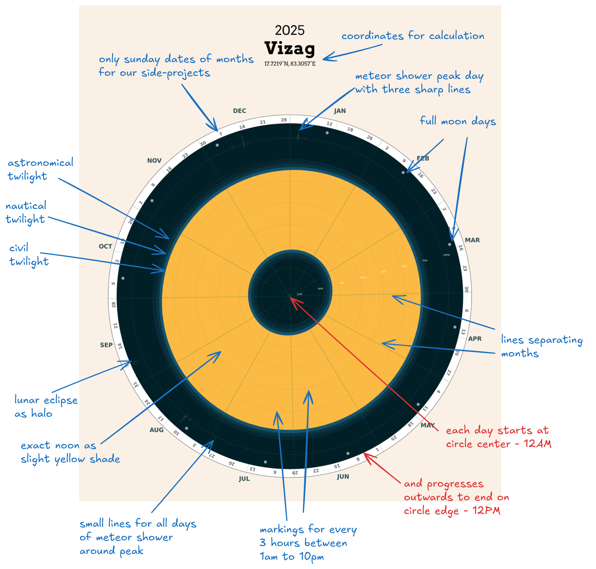

### 2025 Calendar

- Polar design for major Indian cities
- Easy to modify and customise it for your own location (just 300 lines of python)
- Plot with focus on sunrise, noon, sunset, twilights, full moons, eclipses, major meteor showers and Sundays (yay)

### How to read

All days start at center, and each day ends on the outer edge of circle at that day's angle (365 days adjusted in 360 degrees),

twilights are marked for morning and evenings (helpful in catching space stations), 

full moons have gray circle and lunar eclipse is marked as halo, 

three major meteor showers of quadrantids, perseids, and geminids are shown as lines at peak and few small lines during their duration, 

exact noon for your location as a slightly yellow shade line,

and finally only Sunday dates are marked on outer edge for simplicity (do the math!!)

Do share with other friends, print for your room or gift it. Advance happy new year!

#### Support

If you love the design and want to support me, you can buy me a book :)

  

